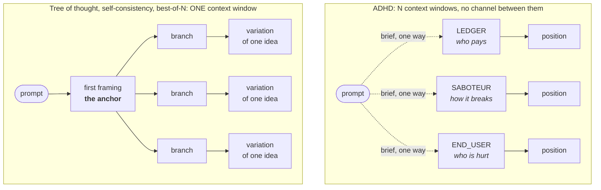
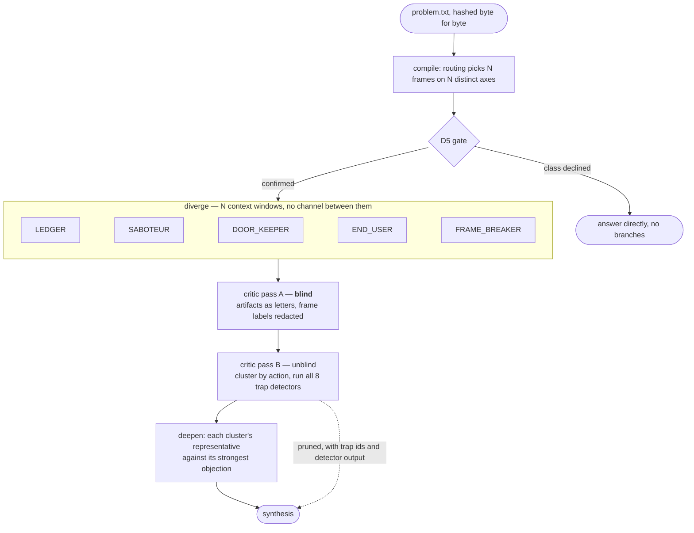
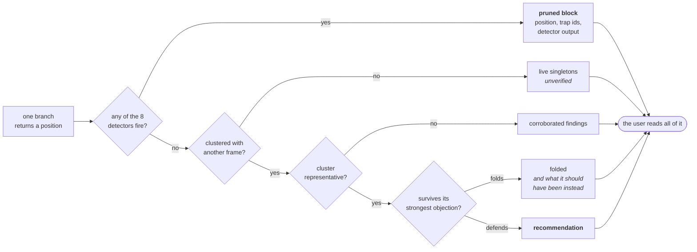
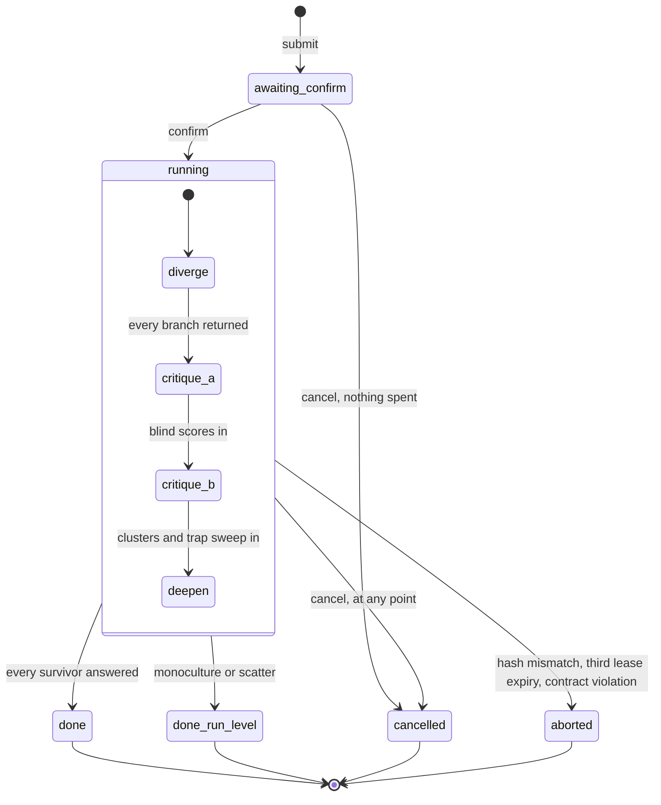

<p align="center">
  
</p>

# ADHD

A reasoning architecture for Claude Code. Not a prompting technique.

## The problem

Linear chain of thought anchors on whatever it says first. Tree of thought widens the
search but every branch walks a single shared context, so the anchor propagates into
the branches and the tree explores variations of one idea instead of several ideas.

Self consistency and best of N have the same defect: sampling the same conditioned
distribution N times gives you N draws from one basin.



The dotted arrows go one way. A branch receives its brief and returns an artifact; it
never learns that the others exist, how many there are, or what they said.

ADHD treats this as an architecture problem. It spawns N isolated reasoning processes
under deliberately distorted cognitive frames, with **zero shared context during
divergence**, then runs a separate critic pass to score blind, cluster, prune traps,
and deepen the survivors.

## The motivating failure

> Prompt: "What timeouts should I set on this HTTP client?"

Linear CoT answer: 15s to first token, 30s between tokens, 90s absolute, one auto retry.
Cites Google SRE Book ch. 22. Sensible. The answer a senior engineer gives in 30 seconds.

What it never surfaces:

- The human is an actor in this system and can cancel. Nothing models the bail out path.
- "Wait, then retry the same model" was accepted as the frame and never questioned. If it
  stalled once, why is the same instance the right target for retry number two?
- Who pays for the retry. Token cost of a retried long generation is not free.
- No trap is named. The answer reads complete because it is fluent, not because it is done.

That prompt ships as `evals/fixtures/001-http-timeouts.yaml`. It is the regression test for
the whole system. If a run only returns the timeout triple, the run failed.

## When to reach for it

Design decisions. Fuzzy debugging where the symptom does not name the cause. Naming.
API surface design. Strategy. Any prompt of the shape "give me a few ways to...".

Do **not** use it for factual lookup, mechanical refactors, or anything with one correct
answer. It costs N times the tokens. Spend that only where the search space is the problem.

## Execution model

No API keys. No provider SDK. No billing surface of its own.

Branches run as Claude Code subagents. Subagents already give what ADHD needs and what
no in context technique can give: a genuinely separate context window per branch. The
isolation is real, not simulated by an instruction to ignore prior text.

The library and the MCP server never call a model. They compile plans, enforce the
isolation contract, score outputs against the rubric, and run the eval harness. Inference
is supplied by the host.



Nothing is spent before the gate. The preview shows the problem verbatim with its hash and
a token estimate, and the run does not start until a human agrees to it.

### What reaches the user

A pruned position is not a discarded one. Every path through the critic ends at the reader,
which is why the pruned block is a non-negotiable rather than a debugging aid.



`END_USER` is the case that justifies the rule. It has been pruned in both runs it appeared
in, and it is also the frame that closed the who-is-hurt gap in `002-kernel-enduser`. The
question reached the user through the pruned block, after the critic rejected the position
carrying it.

## Layout

```
config/       frames, routing, critic rubric      <- the actual IP
prompts/      orchestrator, branch, critic, deepen
docs/         architecture, trap taxonomy, open decisions
evals/        fixtures with must_surface assertions, recorded runs
skills/adhd/  Claude Code skill
agents/       subagent definitions
```

## Install

As a Claude Code plugin, from a checkout:

```
git clone https://github.com/drewc611/Ai-adhd.git && cd Ai-adhd
npm install && npm run build
claude plugin add .            # or point your plugin marketplace at this directory
```

The plugin registers the `/adhd` skill, the branch, critic, and deepen agents, and the MCP
server. The MCP server can also be used on its own by any MCP host:

```
node dist/src/mcp.js           # stdio; the four commands plus the ten kernel verbs, 14 tools
```

## Quickstart

```
npm install && npm test          # builds, then runs the contract tests and the eval harness
node dist/src/cli.js wizard       # menus over every verb below; each screen prints the command it ran
node dist/src/cli.js viewer       # one self-contained HTML page over every recorded run
node dist/src/cli.js validate    # loads config/ and prompts/, runs the D6 static check
node dist/src/cli.js frames      # the library
node dist/src/cli.js eval        # replays evals/recorded/ against evals/fixtures/
node dist/src/cli.js eval --audit            # which assertions the consensus answer also satisfies
node dist/src/cli.js diff <runA> <runB>      # two runs of one fixture: what moved, and whether it was the seed
node dist/src/cli.js why <run> <frame>      # everything that happened to one frame: pass A row, cluster, detectors, deepen
node dist/src/cli.js frames --stats          # how each frame has behaved across recorded runs
node dist/src/cli.js frames --orthogonality  # D6: which frames are duplicates in practice
node dist/src/cli.js frames --collisions     # which frame names are also ordinary prose
node dist/src/cli.js learn --sensitivity     # do the rubric weights change which position ships?
node dist/src/cli.js learn --correlation     # do two dimensions measure the same thing?
node dist/src/cli.js learn --run <dir> --agreement <passA.yaml>   # do two critics ship the same answer?
node dist/src/cli.js learn --agreement-all   # the same, pooled over every run that has a second scoring
node dist/src/cli.js learn --panel --run <dir>   # three or more critics on one pack: ambiguous rubric, or odd critic?
```

`learn` reads the recorded runs and calls nothing. It is how the frame library, the rubric and
the fixtures get changed on evidence rather than on taste. Current findings are in D8.

<details>
<summary><b>Exit codes</b> — a script driving a run branches on these, so each means one thing</summary>

| code | meaning |
|---|---|
| 0 | ok |
| 1 | a contract violation (`traps`), a failing eval, a flagged orthogonality pair, a `diff` of two different problems, or an unexpected error |
| 2 | `ContractError`: an artifact broke the contract where the run needed it not to |
| 3 | `RunAbort`: the run is over. A `problem_hash` mismatch is the usual cause. Also returned by `os claim` with nothing claimable and `os result` with no synthesis yet |
| 4 | the repository is invalid: a missing or malformed file under `config/`, `prompts/` or `docs/` |
| 5 | the command line is wrong. The repository is fine |

</details>

`wizard` needs a terminal and says so when piped, so it never blocks in CI. `viewer` inlines
the run data rather than fetching it, so the page opens from disk with nothing to serve: pick a
run and a frame and you get the blind pass A row with the critic's evidence, every detector that
fired with the text that fired it, the cluster and its margin, and the deepen verdict. Filter by
trap to see everything T1 caught across a run, or by status to read only what was pruned.

A run is four commands driven by the host (see `skills/adhd/SKILL.md`):

```
adhd run --phase compile --problem problem.txt --decision '{"problem_class":"design_decision"}'
adhd run --phase critique --run runs/<id>     # twice: pass A brief, then pass B brief
adhd run --phase deepen   --run runs/<id>
adhd run --phase synth    --run runs/<id>     # add --partial after a cancel
```

The MCP server (`node dist/src/mcp.js`) exposes the same four as `adhd_run`, `adhd_traps`,
`adhd_eval`, `adhd_frames`, plus the ten kernel verbs. Kernel tools take `root` (the repository
holding `config/` and `prompts/`) and `os_root` (the runs directory) as separate arguments; see
`docs/OS.md`.

## Status

Library, CLI, MCP server, and plugin are implemented and tested against the contracts in
`CLAUDE.md`. D1 through D8 are resolved in `docs/DECISIONS.md`.

Five real runs are recorded, five isolated subagents each, plus a linear chain-of-thought
negative control per fixture that must fail, plus three decline fixtures that assert routing
refuses a class rather than spending on it. Every real run has been scored a second time by a
fresh blind critic: 79% exact over 225 cells, 100% within one point, and one run in five whose
recommendation depends on which critic read it. Four critics on that pack split 2-2, and every
contested decision in the corpus turns out to be settled inside two anchor points out of 48 (D8).

<details>
<summary><b>What each recorded run found</b>, including the two recorded as failing</summary>

- `evals/recorded/001-first-run/` passes fixture 001. The critic pruned LEDGER (T2, T7) and
  MINIMALIST (T1, T2, T6); ACTOR_CENSUS and FRAME_BREAKER converged from different axes on
  caller-owned deadlines and the cancel path; both survivors defended under objection.
- `evals/recorded/002-first-run/` fails fixture 002 on one item and is recorded as such: no
  branch in the fuzzy debugging frame set asked who the p99 tail lands on. The critic pruned
  SABOTEUR (T1) and NIGHT_OPERATOR (T2); PARTICULARIST with MECHANIC and FRAME_BREAKER with
  NIGHT_OPERATOR formed two clusters; both survivors defended and each withdrew a claim.

- `evals/recorded/002-kernel-enduser/` passes fixture 002. Same prompt, END_USER swapped in
  for NIGHT_OPERATOR through an explicit frame list, and the first run driven end to end by
  the kernel: nine tasks claimed and returned by one worker, four automatic phase advances,
  real token accounting. END_USER asked who is hurt and was pruned for it, so the question
  reached the output through the pruned block. MECHANIC folded under objection.
- `evals/recorded/003-kernel-strategy/` passes fixture 003 (strategy class, monolith rewrite),
  driven by the kernel. All five frames refused the year-long rewrite; the critic pruned
  PRIOR_ART (T1, T2) and FRAME_BREAKER (T1) for answers that would not change if the problem
  did, and the two survivors each gave ground under objection. The run found three bugs in
  the plumbing, listed in its `README.md`.
- `evals/recorded/004-kernel-naming/` fails fixture 004 on one item and is recorded as
  failing. The naming class was expected to produce a monoculture and did not: five frames,
  four clusters, two positions that cannot both be acted on. Two folded under objection and
  said what they should have been instead. Nobody asked what the flag's name asserts when it
  is false, which is a frame-set gap, kept visible rather than patched out of the fixture.

</details>

Each run's `README.md` says how it was produced and what it did not surface.

## As an agent operating system

The four phases can run unattended. `src/os.ts` is a kernel over run directories: it owns
state, leases, phase advancement, the D5 gate, and cancellation, and it never calls a model.



A cancel is not a discard. Every branch that already returned is rendered as a partial,
marked UNSCORED, with the pruned block absent and said to be absent, so a reader who has
learned to look for that block is told why there isn't one.

Hosts supply inference by claiming tasks and returning artifacts, over MCP or the CLI:

<details>
<summary><b>The syscalls</b>, over MCP or the CLI</summary>

```
adhd os submit --problem p.txt --decision '{"problem_class":"design_decision"}'   # preview, awaiting_confirm
adhd os confirm <run_id>                                                           # branch tasks claimable
adhd os claim --worker w1        # -> {agent, brief, continues}; spawn that agent with the brief
adhd os return <task_id> --file out.yaml --worker w1   # kernel validates and advances the run
adhd os status <run_id> | adhd os result <run_id> | adhd os cancel <run_id>
```

The same verbs are MCP tools (`adhd_submit`, `adhd_confirm`, `adhd_claim`, `adhd_return`,
`adhd_status`, `adhd_result`, `adhd_cancel`, `adhd_list`), so any MCP host can submit work and
any Claude Code session running the `adhd-worker` skill can execute it. `docs/OS.md` has the
process model and the syscall table.

</details>

## Contributing

Read `CONTRIBUTING.md`. Frames are the expensive part and have a proposal process (D6 in
`docs/DECISIONS.md`) and a retirement bar (`docs/RETIREMENT.md`), because a library that only
grows eventually contains three frames producing one answer, which is the monoculture this exists
to prevent arriving by the back door. Fixtures are claims about what a good run must surface;
tighten them, never loosen them.

## License

MIT. See `LICENSE`.
