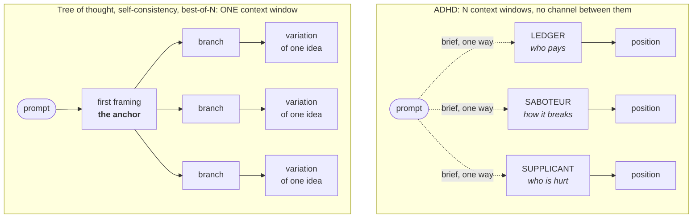

<p align="center">
  
</p>

<p align="center">
  <a href="https://github.com/drewc611/Ai-adhd/actions/workflows/test.yml"></a>
  <a href="https://github.com/drewc611/Ai-adhd/actions/workflows/library.yml"></a>
  <a href="https://github.com/drewc611/Ai-adhd/actions/workflows/codeql.yml"></a>
  <a href="https://github.com/drewc611/Ai-adhd/actions/workflows/maintenance.yml"></a>
  <a href="https://github.com/drewc611/Ai-adhd/actions/workflows/train.yml"></a>
  <a href="#install"></a>
  <a href="docs/DECISIONS.md#d2-what-the-library-does-given-it-cannot-call-a-model"></a>
  <a href="test/"></a>
  <a href="analysis/tests/"></a>
  <a href="docs/DECISIONS.md"></a>
  <a href="package.json">= 20"></a>
  <a href="LICENSE"></a>
</p>

# ADHD

**Anchoring Defeat by Heterogeneous Divergence.** A reasoning architecture for Claude Code:
one prompt, N isolated subagents under deliberately distorted frames, a blind critic that
scores and prunes, then deepening on what survived.

It is not a prompting technique. Nothing here calls a model.

## The problem

Linear chain of thought anchors on whatever it says first. Tree of thought widens the search,
but every branch walks a single shared context, so the anchor propagates into the branches and
the tree explores variations of one idea instead of several ideas. Self-consistency and
best-of-N have the same defect: sampling one conditioned distribution N times gives N draws
from one basin.



The dotted arrows go one way. A branch receives its brief and returns an artifact. It never
learns the others exist, how many there are, or what they said.

## Why prompting cannot fix it

The isolation is real, not simulated. Branches run as separate Claude Code subagents, which is
the one thing no in-context technique can give: a genuinely separate context window per branch.
Telling one model to forget what it just wrote leaves the text in the window. A process
boundary removes it.

That constraint is the whole design, and it is why this repository has no API key, no provider
SDK, and no billing surface. See [D2](docs/DECISIONS.md).

## The four phases

| | phase | what happens |
|---|---|---|
| 01 | **compile** | Route the problem to a class, draw `n` frames one per axis, render one brief per branch. Print the plan and stop for confirmation. |
| 02 | **critique** | Pass A scores every artifact blind, with frame labels hidden. Pass B unblinds, clusters, sweeps all eight traps mechanically, and names the strongest objection to each survivor. |
| 03 | **deepen** | One fresh subagent per survivor, holding its own position and one objection. Defends or folds. Never sees a sibling. |
| 04 | **synth** | Render the recommendation and the pruned block from the artifacts. No model writes it. |

Pruning happens before deepening, so tokens are only spent extending what survived. The user
can stop between any two phases and keep everything produced so far.

## The frame library

Thirteen frames on eleven axes. Routing picks `n` for a problem class, one per axis, so a run
cannot ask the same question twice under two names.

| axis | frame | attacks |
|---|---|---|
| particulars | `PARTICULARIST` | T1 |
| frame_validity | `FRAME_BREAKER` | T2 |
| cost | `LEDGER` | T1, T6 |
| reversibility | `DOOR_KEEPER` | T7 |
| adversary | `SABOTEUR` | T6, T7 |
| scope | `MINIMALIST` | T1, T4, T5 |
| precedent | `PRIOR_ART` | T2, T8 |
| actors | `ACTOR_CENSUS` · `SUPPLICANT` | T6 / T1, T6 |
| mechanism | `MECHANIC` | T3 |
| derivation | `FIRST_PRINCIPLES` | T1, T3 |
| operation | `NIGHT_OPERATOR` · `SUCCESSOR` | T6, T4 / T7, T4 |

Each frame exists to defeat a named trap in [`docs/TRAPS.md`](docs/TRAPS.md): T1 consensus,
T2 frame accepted, T3 borrowed authority, T4 option list, T5 no verdict, T6 missing actor,
T7 reversibility, T8 voice over content. A frame that agrees with the others earns nothing.

Adding a frame requires the orthogonality check in [D6](docs/DECISIONS.md).
[`docs/RETIREMENT.md`](docs/RETIREMENT.md) sets the bar for taking one out.

## Install

As a Claude Code plugin:

```
/plugin marketplace add drewc611/Ai-adhd
/plugin install adhd@adhd
```

From a checkout:

```
git clone https://github.com/drewc611/Ai-adhd.git && cd Ai-adhd
npm install && npm run build
claude plugin marketplace add .
```

The skill and the four run agents work immediately. The MCP server needs the build, because
`dist/` is a build artifact.

## Quickstart

```
npm install && npm test                    # build, contract tests, eval harness
node dist/src/cli.js wizard                # menus over every verb; each screen prints what it ran
node dist/src/cli.js validate              # do the three config files agree with each other
node dist/src/cli.js doctor                # does this installation agree with itself
node dist/src/cli.js frames --health       # how each frame has behaved across recorded runs
node dist/src/cli.js viewer                # one self-contained HTML page over every recorded run
```

To run one, use the skill: `/adhd <your problem>`. It captures your problem verbatim, shows
you the plan and the token estimate, and spends nothing until you say yes.

## The four surfaces

- **CLI** — `adhd` for one-off runs from a terminal.
- **Library** — pure functions over the YAML in `config/`, to call from your own code.
- **MCP server** — `node dist/src/mcp.js`, the same verbs as stdio tools for any MCP host.
- **Claude Code plugin** — the `/adhd` skill plus the branch, critic and deepen agents.

The four phases can also run unattended. `src/os.ts` is a kernel over run directories that owns
state, leases, phase advancement, the D5 gate and cancellation, and never calls a model; hosts
supply inference by claiming tasks and returning artifacts. The state machine and the syscall
table are in [`docs/ARCHITECTURE.md`](docs/ARCHITECTURE.md) and [`docs/OS.md`](docs/OS.md).

## Reach for it when

A design decision has more than one defensible answer. A bug is fuzzy and the first theory
keeps winning. You are naming something. You are shaping an API surface. Any prompt that
starts "give me a few ways to".

Do **not** use it for factual lookup, mechanical refactors, or anything with one correct
answer. It costs N times the tokens. Spend that only where the search space is the problem.

## Where things live

```
config/     frames, routing, critic rubric        <- the actual IP
prompts/    orchestrator, branch, critic, deepen, synthesis
agents/     four run subagents, five mission subagents, the trainer and its governor
skills/     adhd (drives a run), adhd-worker (executes one), superagent (drives a mission)
src/        compiler, validator, scorer, harness, kernel, CLI, MCP server
test/       510 tests over all of it
bin/        adhd-mcp.mjs: the plugin's MCP entry point, and what it says when unbuilt
assets/     the mark, the banner, the run explorer shell
scripts/    demo.sh: what a clean checkout can show without a model
evals/      fixtures with must_surface assertions, recorded runs, negative controls
docs/       architecture, traps, decisions, experiments, backlog, retirement, writeup, superagent
analysis/   Python: reliability statistics and two language models trained from scratch
```

Nothing under `src/` calls a model. Nothing under `analysis/` does either, and nothing under
`src/` imports it: it reads the recorded corpus after the fact and writes text. Delete
`analysis/` and every run behaves identically.

## Status

Library, CLI, MCP server and plugin are implemented and tested against the contracts in
`CLAUDE.md`. D1 through D44 are resolved in [`docs/DECISIONS.md`](docs/DECISIONS.md).

Seventeen runs are recorded over five fixtures, with a linear chain-of-thought negative control
per fixture that must fail, and three decline fixtures asserting that routing refuses a class
rather than spending on it.

**The honest reading of that corpus is in [`docs/WRITEUP.md`](docs/WRITEUP.md), and it is not
flattering.** Three results decide how to read everything else:

- **Divergence reproduces. Adjudication does not.** The same fixture at the same seed with
  byte-identical briefs: branch positions came back nearly verbatim from separate context
  windows, and the critic fired T7 twice on one run and nothing at all on the other. The half
  that prunes is the unstable half.
- **Two critics scoring one pack rank it differently every time.** 81% exact agreement over
  305 cells and seven double-scored packs; in two of them the shipped recommendation changed
  with the critic.
- **The pass A noise floor is 0.10**, and no contested decision in the corpus clears it by
  more than a rounding error. A margin smaller than that is the session and the critic, not
  the reasoning.

`adhd eval --audit` reports per-assertion hit rates rather than leaving them to prose, and
[`docs/EXPERIMENTS.md`](docs/EXPERIMENTS.md) registers every experiment with its readings
fixed before it runs. Nothing here is evidence that the frame library picks better answers
than one careful pass, and no sentence in this repository should be read as claiming it does.

## Contributing

[`CONTRIBUTING.md`](CONTRIBUTING.md) has the workflow. [`docs/MANIFEST.md`](docs/MANIFEST.md)
is how code here gets written and binds every change.

## License

MIT. See [LICENSE](LICENSE) and [NOTICE](NOTICE).
