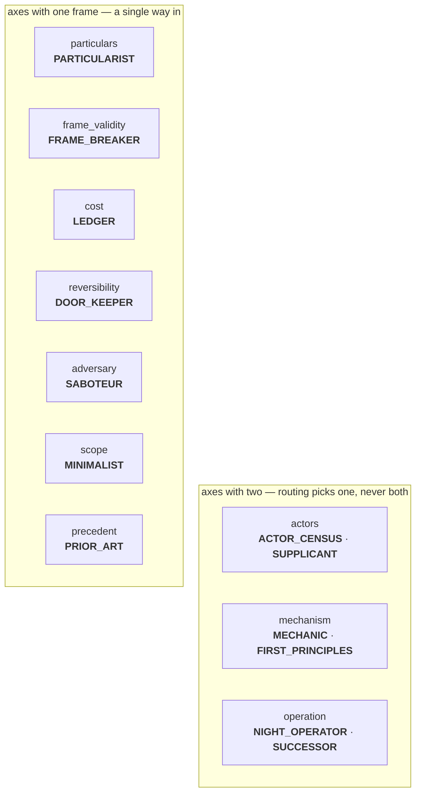
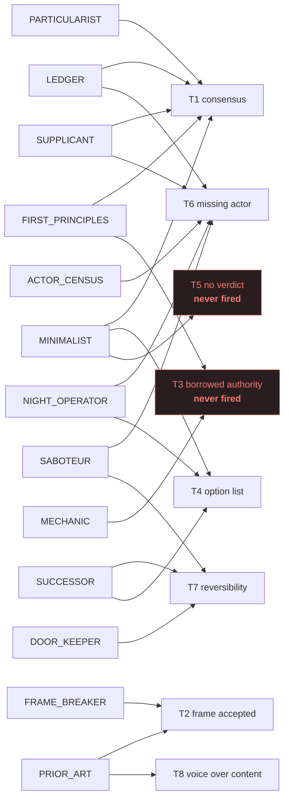
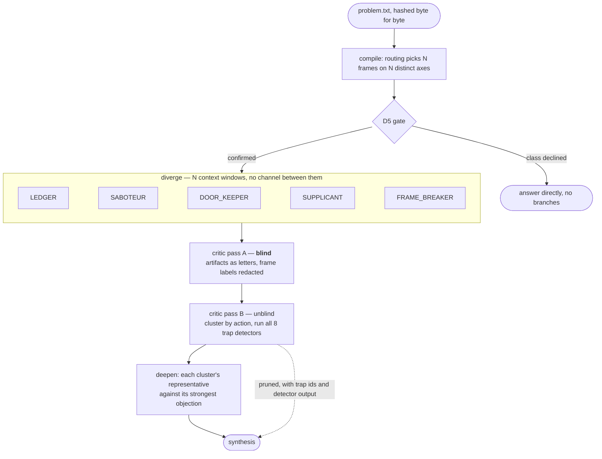
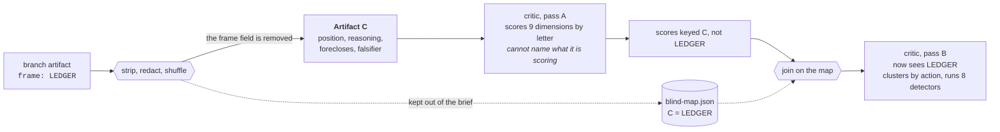
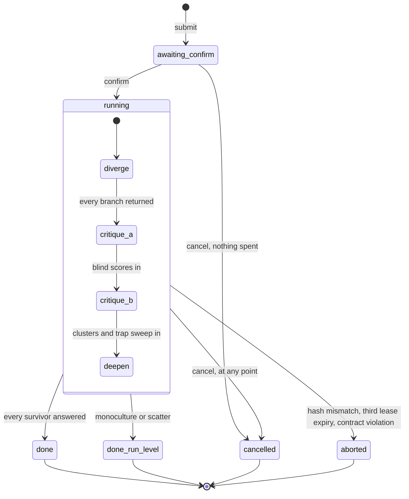

<p align="center">
  
</p>

<p align="center">
  <a href="https://github.com/drewc611/Ai-adhd/actions/workflows/test.yml"></a>
  <a href="https://github.com/drewc611/Ai-adhd/actions/workflows/library.yml"></a>
  <a href="https://github.com/drewc611/Ai-adhd/actions/workflows/codeql.yml"></a>
  <a href="https://github.com/drewc611/Ai-adhd/actions/workflows/maintenance.yml"></a>
  <a href="https://github.com/drewc611/Ai-adhd/actions/workflows/train.yml"></a>
</p>

<p align="center">
  <a href="#install"></a>
  <a href="docs/DECISIONS.md#d2-what-the-library-does-given-it-cannot-call-a-model"></a>
  <a href="test/"></a>
  <a href="analysis/tests/"></a>
  <a href="docs/DECISIONS.md"></a>
  <a href="package.json">= 20"></a>
  <a href="LICENSE"></a>
</p>

# ADHD

A reasoning architecture for Claude Code. Not a prompting technique.

## The problem

Linear chain of thought anchors on whatever it says first. Tree of thought widens the
search but every branch walks a single shared context, so the anchor propagates into
the branches and the tree explores variations of one idea instead of several ideas.

Self consistency and best of N have the same defect: sampling the same conditioned
distribution N times gives you N draws from one basin.


The dotted arrows go one way. A branch receives its brief and returns an artifact; it
never learns that the others exist, how many there are, or what they said.

ADHD treats this as an architecture problem. It spawns N isolated reasoning processes
under deliberately distorted cognitive frames, with **zero shared context during
divergence**, then runs a separate critic pass to score blind, cluster, prune traps,
and deepen the survivors.

## The motivating failure

> Prompt: "What timeouts should I set on this HTTP client?"

Linear CoT answer: 15s to first token, 30s between tokens, 90s absolute, one auto retry.
Cites Google SRE Book ch. 22. Sensible. The answer a senior engineer gives in 30 seconds.

What it never surfaces:

- The human is an actor in this system and can cancel. Nothing models the bail out path.
- "Wait, then retry the same model" was accepted as the frame and never questioned. If it
  stalled once, why is the same instance the right target for retry number two?
- Who pays for the retry. Token cost of a retried long generation is not free.
- No trap is named. The answer reads complete because it is fluent, not because it is done.

That prompt ships as `evals/fixtures/001-http-timeouts.yaml`. It is the regression test for
the whole system. If a run only returns the timeout triple, the run failed.

**It does not pass reliably, and `adhd eval --audit` says how unreliably.** Across the three real
recorded runs of this fixture it has passed once — in the run it was written against.

| assertion | seed 1 | seed 2 | alt frames | rate |
|---|---|---|---|---|
| the human who can cancel | ok | **miss** | ok | 2/3 |
| the retry target questioned | ok | ok | **miss** | 2/3 |
| who pays for the retry | ok | ok | **miss** | 2/3 |
| a trap named | ok | ok | ok | 3/3 |

**The four assertions have different dependencies, and that is the finding.** An earlier version of
this paragraph explained the seed-2 misses away as a quirk of one sample rather than anything to do
with the frame library, and E1b contradicted it. E3 then found that one of the two was neither: *who
pays for the retry* had missed at seed 2 because the assertion's patterns only recognised seed 1's
wording. `LEDGER` priced retries as a share of traffic and the critic's own detector output named the
payer; the regexes wanted "pays for" and got "payer". Widening a pattern after seeing which runs
failed is the move this repo refuses, so E3 registered the candidates and the adoption rule first and
let the negative control decide. Two of three were adopted. The third, `retry budget`, cleared the
control and was refused anyway: it matches a currency with no payer, and this item asks for both.

*The human who can cancel* survived the frame swap and not the reseed, so for that one the sample
reading holds. Nothing here is at 3/3 except the assertion that asks least.

The audit reports these rates rather than leaving them to prose, and a `sometimes` verdict is not a
pattern to loosen: it says nothing in the dispatched set reliably asks that question. The only
assertion that holds everywhere is `trap_named`, which asks almost nothing — any `T[1-8]` anywhere in
the pruned block. `docs/EXPERIMENTS.md` registered both experiments before they ran.

## When to reach for it

Design decisions. Fuzzy debugging where the symptom does not name the cause. Naming.
API surface design. Strategy. Any prompt of the shape "give me a few ways to...".

Do **not** use it for factual lookup, mechanical refactors, or anything with one correct
answer. It costs N times the tokens. Spend that only where the search space is the problem.

## The frame library

Thirteen frames on ten axes. Routing picks n of them for a problem class, one per axis, so a run
cannot ask the same question twice under two names.



Each frame exists to defeat a named trap from `docs/TRAPS.md`. Drawing that as a graph shows
where the library is thick and where it is one frame deep.



`T1` and `T6` have five attackers each; `T8` has one. The two in red have never fired in any
recorded run, which is either prevention working or dead weight, and the counts cannot say
which. `T5` is close to structurally unable to fire, because the output contract already demands
a committal position. `docs/RETIREMENT.md` sets the bar for acting on any of it.

## Execution model

No API keys. No provider SDK. No billing surface of its own.

Branches run as Claude Code subagents. Subagents already give what ADHD needs and what
no in context technique can give: a genuinely separate context window per branch. The
isolation is real, not simulated by an instruction to ignore prior text.

The library and the MCP server never call a model. They compile plans, enforce the
isolation contract, score outputs against the rubric, and run the eval harness. Inference
is supplied by the host.



Nothing is spent before the gate. The preview shows the problem verbatim with its hash and
a token estimate, and the run does not start until a human agrees to it.

### How pass A stays blind

The critic scores the artifacts before it is allowed to know which frame wrote any of them. The
map that would tell it is written to disk and kept out of the brief until pass A has returned.



Redaction is not only the `frame` field. A branch writes "from inside the Door keeper stance"
far more naturally than it writes `DOOR_KEEPER`, so every id and display name goes, in any
casing and across any separator. A label the problem statement itself uses is exempt, because
every branch is free to echo the problem and echoing it identifies nobody.

### What reaches the user

A pruned position is not a discarded one. Every path through the critic ends at the reader,
which is why the pruned block is a non-negotiable rather than a debugging aid.


`SUPPLICANT` (which ran as `END_USER`, before the rename in D6) is the case that justifies the rule. It has been pruned in both runs it appeared
in, and it is also the frame that closed the who-is-hurt gap in `002-kernel-enduser`. The
question reached the user through the pruned block, after the critic rejected the position
carrying it.

## Layout

```
config/     frames, routing, critic rubric      <- the actual IP
prompts/    orchestrator, branch, critic, deepen, synthesis
docs/       architecture, traps, decisions, superagent, manifest, provenance, distribution, backlog
evals/      fixtures with must_surface assertions, recorded runs and controls
bin/        adhd-mcp.mjs: the plugin's MCP entry point, and what it says when unbuilt
src/        compiler, validator, scorer, harness, kernel, CLI, MCP server
test/       425 tests over all of it
analysis/   Python: reliability, bootstrap intervals, two language models trained from scratch
skills/     adhd (drives a run), adhd-worker (executes one), superagent (drives a mission)
agents/     four run subagents, five mission subagents, the trainer and its governor
assets/     the mark, the banner, the run explorer shell
scripts/    demo.sh: what a clean checkout can show without a model
```

Nothing under `src/` calls a model. It compiles briefs, enforces the isolation contract, scores
what comes back, and refuses to proceed when a record is missing. Nothing under `analysis/` calls
one either, and nothing under `src/` imports it: it reads the recorded corpus after the fact and
writes text. Delete the directory and every run behaves identically.

`analysis/` does train language models, and that is not a contradiction. Two classes: modified
Kneser-Ney over a document library you point it at, built from counts in the standard library, and
since D20 a decoder-only transformer whose only dependency is numpy. No weights are downloaded and
none ship; every parameter in either comes from a corpus this repository can name. D9 draws the line
and D10 applies it: a model that changes what a run outputs is banned, a model that describes what
runs already output is a measuring instrument.

## Install

As a Claude Code plugin, from the marketplace this repository is:

```
/plugin marketplace add drewc611/Ai-adhd
/plugin install adhd@adhd
```

The skill, the four run agents and the commands work immediately. The MCP server needs a build,
because `dist/` is a build artifact; `bin/adhd-mcp.mjs` says so in a sentence rather than failing
with a path inside the host's plugin cache.

From a checkout, with everything built:

```
git clone https://github.com/drewc611/Ai-adhd.git && cd Ai-adhd
npm install && npm run build
claude plugin marketplace add .
```

`docs/DISTRIBUTION.md` maps every other surface: npm, GitHub Packages, the official MCP Registry,
PyPI, Zenodo, the MCP directories, and why the OpenAI app directory is blocked on architecture
rather than on paperwork.

The plugin registers the `/adhd` skill, the branch, critic, and deepen agents, and the MCP
server. The MCP server can also be used on its own by any MCP host:

```
node dist/src/mcp.js           # stdio; the four commands plus the ten kernel verbs, 14 tools
```

## Quickstart

```
npm install && npm test          # builds, then runs the contract tests and the eval harness
node dist/src/cli.js wizard       # menus over every verb below; each screen prints the command it ran
node dist/src/cli.js viewer       # one self-contained HTML page over every recorded run
node dist/src/cli.js validate    # loads config/ and prompts/, runs the D6 static check
node dist/src/cli.js frames      # the library
node dist/src/cli.js eval        # replays evals/recorded/ against evals/fixtures/
node dist/src/cli.js eval --audit            # which assertions the consensus answer also satisfies
node dist/src/cli.js diff <runA> <runB>      # two runs of one fixture: what moved, and whether it was the seed
node dist/src/cli.js why <run> <frame>      # everything that happened to one frame: pass A row, cluster, detectors, deepen
node dist/src/cli.js frames --stats          # how each frame has behaved across recorded runs
node dist/src/cli.js frames --orthogonality  # D6: which frames are duplicates in practice
node dist/src/cli.js frames --collisions     # which frame names are also ordinary prose
node dist/src/cli.js frames --health         # docs/RETIREMENT.md's bar, counted
node dist/src/cli.js frames --axes           # frames per axis, and axes no run has exercised
node dist/src/cli.js frames --drift          # runs that used a frame whose definition has changed since
node dist/src/cli.js cost                    # token spend per run, by phase and by frame, against the estimate
node dist/src/cli.js os stats                # throughput, phase timing and lease expiry rate from the journal
node dist/src/cli.js replay                  # re-render every recorded synthesis and report drift
node dist/src/cli.js doctor                  # does config, prompts, agents, tool grants and the build agree
node dist/src/cli.js lint [fixture]          # can a fixture's patterns compile, and can they fail
node dist/src/cli.js eval --history          # which runs have ever held each assertion
node dist/src/cli.js eval --gate             # fail when an assertion stops holding on a run it used to
node dist/src/cli.js matrix                  # every assertion against every run of its fixture, as a grid
node dist/src/cli.js export <run>            # one run as a single self-contained Markdown file
node dist/src/cli.js open <run>              # what a run directory holds, and what its absences mean
node dist/src/cli.js init <dir>              # scaffold config/ and prompts/ to extend, not start blank
node dist/src/cli.js completions bash        # generated from the real command list
node dist/src/cli.js schema-doc              # regenerate docs/CONFIG.md from the zod schemas
node dist/src/cli.js os watch <run>          # redraw a run's status; one line per change when piped

node dist/src/cli.js super plan --id m --goal g.txt --class deep   # the stage graph, then stop
node dist/src/cli.js super confirm m         # nothing is claimable until this
node dist/src/cli.js super claim m --worker w1               # the next stage, its agent, its brief
node dist/src/cli.js super return m research --worker w1 --goal-hash <h>  # checked against the contract
node dist/src/cli.js super status m          # what is ready, what is waiting, what was withheld
node dist/src/cli.js super memory --audit    # what the isolation rule keeps out of a diverge brief
node dist/src/cli.js super gateway m         # the thread, and every delivery the rule refused
node dist/src/cli.js super sandbox m --diff  # what a build stage changed, before it reaches the tree
npm run demo                                 # what a clean checkout can show without a model
node dist/src/cli.js learn --sensitivity     # do the rubric weights change which position ships?
node dist/src/cli.js learn --correlation     # do two dimensions measure the same thing?
node dist/src/cli.js learn --run <dir> --agreement <passA.yaml>   # do two critics ship the same answer?
node dist/src/cli.js learn --agreement-all   # the same, pooled over every run that has a second scoring
node dist/src/cli.js learn --panel --run <dir>   # three or more critics on one pack: ambiguous rubric, or odd critic?
```

`learn` reads the recorded runs and calls nothing. It is how the frame library, the rubric and
the fixtures get changed on evidence rather than on taste. Current findings are in D8.

<details>
<summary><b>Exit codes</b> — a script driving a run branches on these, so each means one thing</summary>

| code | meaning |
|---|---|
| 0 | ok |
| 1 | a contract violation (`traps`), a failing eval, a flagged orthogonality pair, a `diff` of two different problems, or an unexpected error |
| 2 | `ContractError`: an artifact broke the contract where the run needed it not to |
| 3 | `RunAbort`: the run is over. A `problem_hash` mismatch is the usual cause. Also returned by `os claim` with nothing claimable and `os result` with no synthesis yet |
| 4 | the repository is invalid: a missing or malformed file under `config/`, `prompts/` or `docs/` |
| 5 | the command line is wrong. The repository is fine |

</details>

`wizard` needs a terminal and says so when piped, so it never blocks in CI. `viewer` inlines
the run data rather than fetching it, so the page opens from disk with nothing to serve: pick a
run and a frame and you get the blind pass A row with the critic's evidence, every detector that
fired with the text that fired it, the cluster and its margin, and the deepen verdict. Filter by
trap to see everything T1 caught across a run, or by status to read only what was pruned.

A run is four commands driven by the host (see `skills/adhd/SKILL.md`):

```
adhd run --phase compile --problem problem.txt --decision '{"problem_class":"design_decision"}'
adhd run --phase critique --run runs/<id>     # twice: pass A brief, then pass B brief
adhd run --phase deepen   --run runs/<id>
adhd run --phase synth    --run runs/<id>     # add --partial after a cancel
```

The MCP server (`node dist/src/mcp.js`) exposes the same four as `adhd_run`, `adhd_traps`,
`adhd_eval`, `adhd_frames`, plus the ten kernel verbs. Kernel tools take `root` (the repository
holding `config/` and `prompts/`) and `os_root` (the runs directory) as separate arguments; see
`docs/OS.md`.

## Status

Library, CLI, MCP server, and plugin are implemented and tested against the contracts in
`CLAUDE.md`. D1 through D20 are resolved in `docs/DECISIONS.md`.

Seven real runs are recorded, five isolated subagents each, plus a linear chain-of-thought
negative control per fixture that must fail, plus three decline fixtures that assert routing
refuses a class rather than spending on it. Every real run has been scored a second time by a
fresh blind critic: 79% exact over 225 cells, 100% within one point, and one run in five whose
recommendation depends on which critic read it. Four critics on that pack split 2-2, and every
contested decision in the corpus turns out to be settled inside two anchor points out of 48 (D8).

`analysis/` also trains background language models from scratch on a document library — 6,330
RFCs, 615 PEPs, 323 EIPs and 54 ERCs, no weights downloaded and none shipped. `docs/PROVENANCE.md`
records every corpus's licence and why nothing is redistributed.

The shipped one is modified Kneser-Ney, order 4, standard library only: 64,419,427 tokens over the
training side of a frozen split, 148,353 types, 40,305,629 4-grams, nothing pruned. **Held-out
perplexity 25.82** on 366 frozen documents at 0.91% OOV, fingerprint `1446762140db7f1a`. Two earlier
figures this file carried are corrected rather than beaten: 6.06 was a memorisation score (D16), and
25.65 was measured under an ASCII-only tokenizer that truncated a fifth of the corpus, so a different
tokenization makes it a different measurement rather than a worse one.

There is a second model class since D20: a decoder-only transformer over numpy, written from scratch,
with a hand-written backward pass that is gradient-checked against central differences. It stays
inside D2 — no download, no key, no provider SDK — and it exists to make an assertion falsifiable that
`ngram.py` had carried unmeasured, that a transformer from scratch needs 10^8 tokens and a GPU before
it beats a well-smoothed n-gram. E6 is the run, registered before it started.

Held-out perplexity is what says whether a training run improved anything, because vocabulary size,
table size and wall clock all rise when a model gets worse. Two numbers from different held-out sets
are two numbers about two tests, and `comparable_heldout` refuses five ways to be fooled by that: a
truncated score beside a finished one, the same text tokenized differently, a missing or differing
fingerprint, an in-vocabulary-only score beside an all-targets one, and a vocabulary gap that hands
the smaller vocabulary a discount on all targets. Every one of those is a mistake this repository
published or nearly published. See D13, D16, D20 and `analysis/README.md`.

That 79% is not 79% reliability, and `analysis/` is what says so. Corrected for chance,
`foreclosure` scores Krippendorff's alpha of -0.017 with a 95% interval of [-0.04, +0.00] on 96%
exact agreement, while `reversibility` scores +0.850 on 76%. The two rankings invert, because
percent agreement ranks dimensions by how constant they are. `committal` and `foreclosure` have
intervals containing zero, which at seven runs means unmeasured rather than weak. See
`analysis/README.md` and D9.

<details>
<summary><b>What each recorded run found</b>, including the two recorded as failing</summary>

- `evals/recorded/001-first-run/` passes fixture 001. The critic pruned LEDGER (T2, T7) and
  MINIMALIST (T1, T2, T6); ACTOR_CENSUS and FRAME_BREAKER converged from different axes on
  caller-owned deadlines and the cancel path; both survivors defended under objection.
- `evals/recorded/002-first-run/` fails fixture 002 on one item and is recorded as such: no
  branch in the fuzzy debugging frame set asked who the p99 tail lands on. The critic pruned
  SABOTEUR (T1) and NIGHT_OPERATOR (T2); PARTICULARIST with MECHANIC and FRAME_BREAKER with
  NIGHT_OPERATOR formed two clusters; both survivors defended and each withdrew a claim.

- `evals/recorded/002-kernel-enduser/` passes fixture 002. Same prompt, SUPPLICANT swapped in
  for NIGHT_OPERATOR through an explicit frame list, and the first run driven end to end by
  the kernel: nine tasks claimed and returned by one worker, four automatic phase advances,
  real token accounting. SUPPLICANT asked who is hurt and was pruned for it, so the question
  reached the output through the pruned block. MECHANIC folded under objection.
- `evals/recorded/003-kernel-strategy/` passes fixture 003 (strategy class, monolith rewrite),
  driven by the kernel. All five frames refused the year-long rewrite; the critic pruned
  PRIOR_ART (T1, T2) and FRAME_BREAKER (T1) for answers that would not change if the problem
  did, and the two survivors each gave ground under objection. The run found three bugs in
  the plumbing, listed in its `README.md`.
- `evals/recorded/004-kernel-naming/` fails fixture 004 on one item and is recorded as
  failing. The naming class was expected to produce a monoculture and did not: five frames,
  four clusters, two positions that cannot both be acted on. Two folded under objection and
  said what they should have been instead. Nobody asked what the flag's name asserts when it
  is false, which is a frame-set gap, kept visible rather than patched out of the fixture.

</details>

Each run's `README.md` says how it was produced and what it did not surface.

### What this cannot tell you yet

A reader should start here rather than discover it.

- **Fixture 001 has passed once, in the run it was written against.** Re-run at seed 2 with the
  same five frames it misses two of its four assertions; run with four of five frames swapped it
  misses two others. Different assertions turn out to have different dependencies, and the only
  one robust across all three runs is the weakest one. `docs/EXPERIMENTS.md` has the table.
- **Every per-frame rate here is a one-to-three-sample figure.** At least one of them moves:
  `ACTOR_CENSUS` went from holding the recommendation to pruned on a reseed alone.
- **Four critics on one pack, two on the rest.** 225 cells is a first corpus, not a reliability
  figure.
- **`002-kernel-enduser` is not robust to who scored it.** Four critics split 2-2 on which
  position goes to deepen. Left that way on purpose.
- **`TaskList` is the one isolation claim that is argued rather than demonstrated.** It is the
  launch permit every isolated agent carries, and what it shows a branch inside a running
  dispatch has never been observed. D4 says so.
- **The plugin agents have never run as plugin agents.** Every recorded run used general-purpose
  subagents, so the manifest and the tool grants are checked mechanically and never end to end.
- **One fixture assertion is still satisfied by a negative control.** `003/reframe` matches on
  deploy-pain vocabulary, which the real run uses as a reframe and the consensus answer uses as a
  selling point. Separating them needs a run that has not happened; writing a pattern against the
  two texts already read is how a harness gets tuned until it always passes. Three others were
  flagged with it and are resolved, one of them a regex defect rather than a judgment.

## As an agent operating system

The four phases can run unattended. `src/os.ts` is a kernel over run directories: it owns
state, leases, phase advancement, the D5 gate, and cancellation, and it never calls a model.



A cancel is not a discard. Every branch that already returned is rendered as a partial,
marked UNSCORED, with the pruned block absent and said to be absent, so a reader who has
learned to look for that block is told why there isn't one.

Hosts supply inference by claiming tasks and returning artifacts, over MCP or the CLI:

<details>
<summary><b>The syscalls</b>, over MCP or the CLI</summary>

```
adhd os submit --problem p.txt --decision '{"problem_class":"design_decision"}'   # preview, awaiting_confirm
adhd os confirm <run_id>                                                           # branch tasks claimable
adhd os claim --worker w1        # -> {agent, brief, continues}; spawn that agent with the brief
adhd os return <task_id> --file out.yaml --worker w1   # kernel validates and advances the run
adhd os status <run_id> | adhd os result <run_id> | adhd os cancel <run_id>
```

The same verbs are MCP tools (`adhd_submit`, `adhd_confirm`, `adhd_claim`, `adhd_return`,
`adhd_status`, `adhd_result`, `adhd_cancel`, `adhd_list`), so any MCP host can submit work and
any Claude Code session running the `adhd-worker` skill can execute it. `docs/OS.md` has the
process model and the syscall table.

</details>

## Contributing

Read `CONTRIBUTING.md`. Frames are the expensive part and have a proposal process (D6 in
`docs/DECISIONS.md`) and a retirement bar (`docs/RETIREMENT.md`), because a library that only
grows eventually contains three frames producing one answer, which is the monoculture this exists
to prevent arriving by the back door. Fixtures are claims about what a good run must surface;
tighten them, never loosen them.

## License

MIT. See `LICENSE`.
